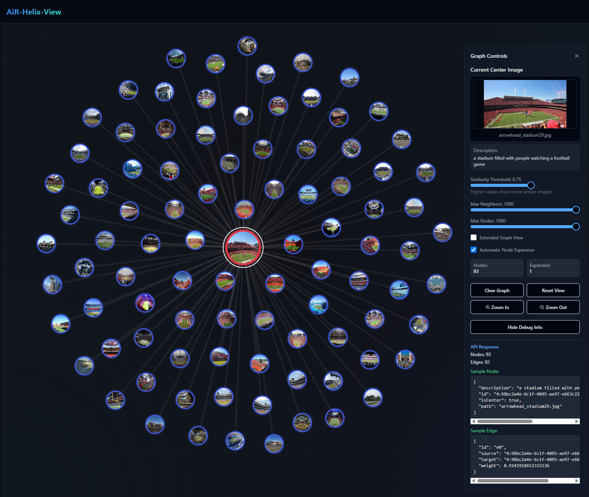
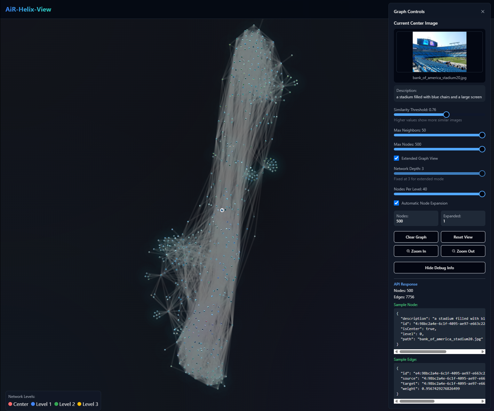
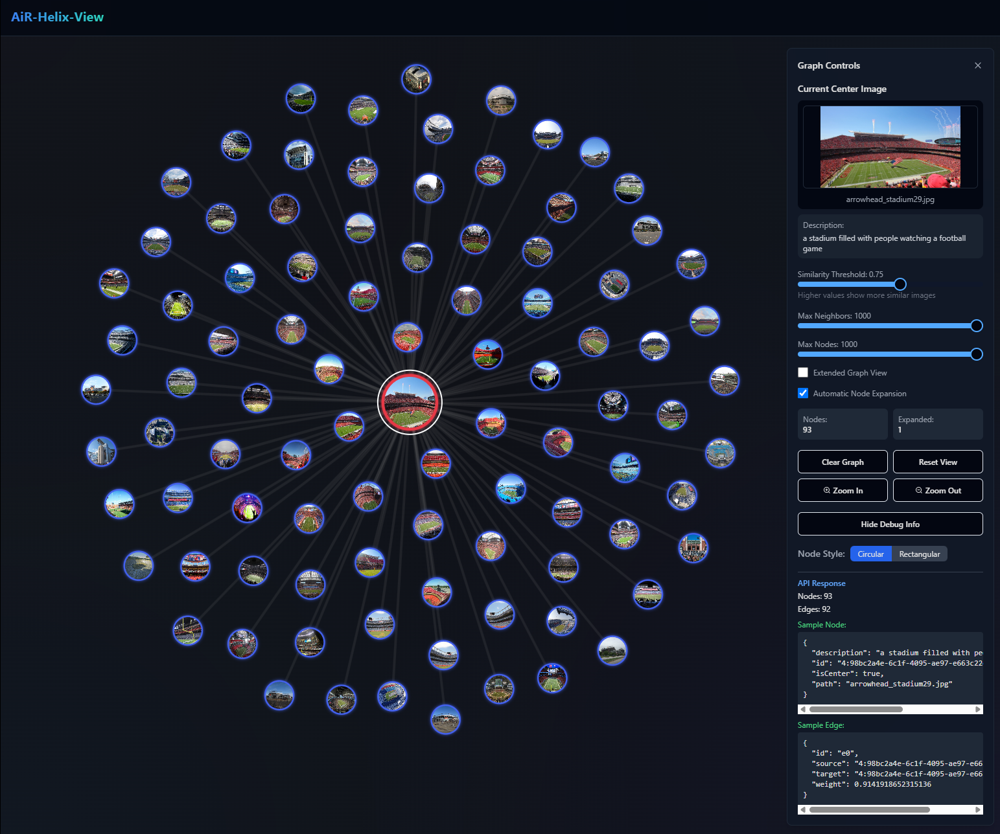
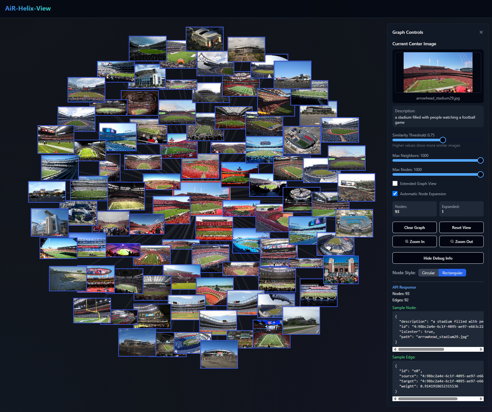
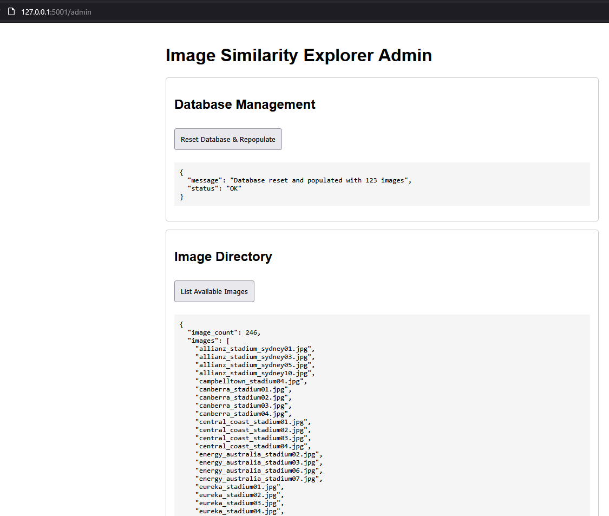
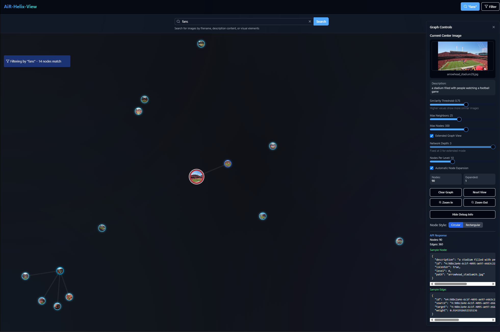

# AiR-Helix-View

### backend
to start backend:
cd to ```./backend```
run ```python app.py```


### frontend
to start frontend:
in another terminal
cd to ```./frontend```
run ```npm start```

---

### current state

##### single node mode


##### extended graph mode - max neighbors


#### switch between Circular and Rectangular render mode for nodes
**circular mode** TODO:fix image distortion

**rectangular mode**


#### TAG filtering implemented


#### KEYWORD filetering implemented



---

# NOTE - admin curretly busted :: TODO: FIX HANG ON BACKEND ADMIN FEATURES...
for admin tasks, while backend running goto:
```http://127.0.0.1:5001/admin```
