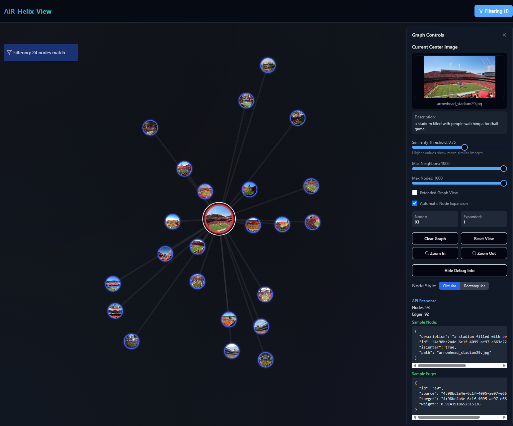

# AiR-Helix-View

to start backend:
cd to ```./backend```
run ```python app.py```

to start frontend:
in another terminal
cd to ```./frontend```
run ```npm start```

current state


---

for admin tasks, while backend running goto:
```/admin```
