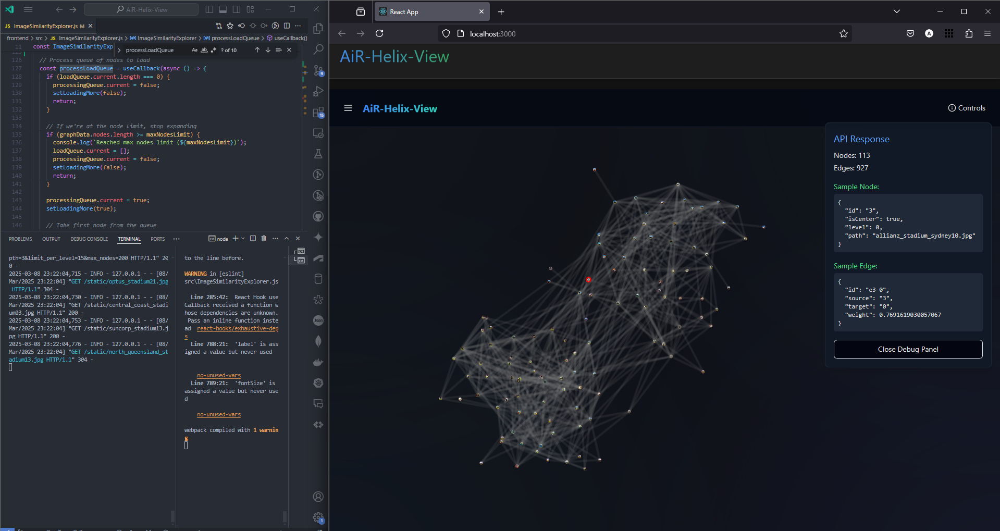

# AiR-Helix-View


### backend

pip install backend deps
```pip install flask flask-cors neo4j python-dotenv sentence-transformers pillow numpy```

to start backend:
cd to ```./backend```
run ```python app.py```


### frontend

npm install frontend deps:
```cd frontend```
```npm install```

to start frontend:
in another terminal
cd to ```./frontend```
run ```npm start```

---

current state



---

for admin tasks, while backend running goto:
```http://127.0.0.1:5001/admin```
